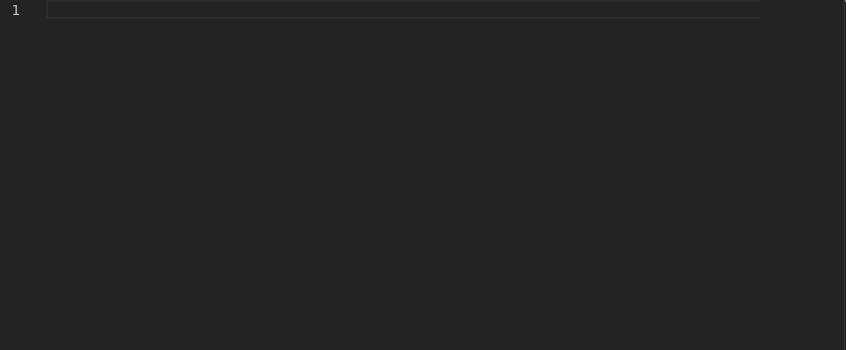
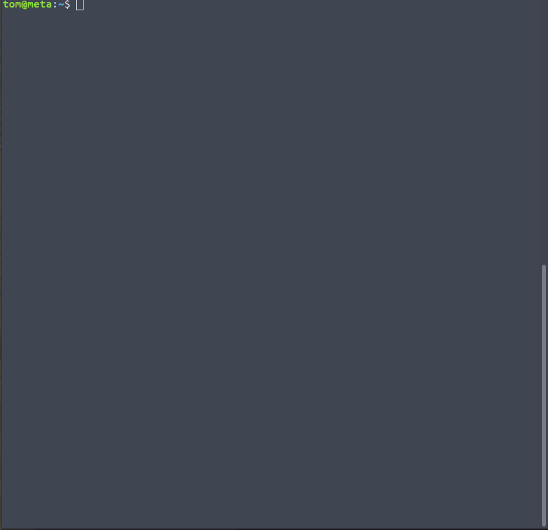

**Description**

`libcn` is an unofficial python library for cyphernode. The `CypherNode` class provide a client object. The `CallbackServer` class provide an easy way to handle callbacks. And `cn-cli` is a command line utility that support some options and tab autocomplete.

**What is cyphernode**

Cyphernode is a modular Bitcoin full-node microservices API server architecture and utilities toolkit to build scalable, secure and featureful apps and services without trusted third parties. For more information visit:  https://github.com/SatoshiPortal/cyphernode

**Disclaimer**

This project is experimental, so be sure you understand what this program does, before using it. I take NO responsibility of domage that can result from using this program. See LICENSE file provided with the source code for more information.

****
**Prerequires**

- A cyphernode api server running
- Python3 installed on client machine
- Modules installed in your python environement
  - argparse
  - configparser
  - requests
  - urllib3

****

**From ``pip``**

--TODO--

****

**From `setup.py`**

--TODO--

****

 **From sources**

Clone libcn :
```
~/$ git clone https://github.com/tomtibo/libcn/
```
****
By default, `CypherNode` class and `cn-cli` utility will look for a config file at $HOME/.cn/cn.conf. Optionaly you can specify the config file location with `configfile` argument OR using `cnid`, `key` and `url` arguments directly. When using `cn-cli` command line utility, using `--cnid`, `--key` and `--url` prevent secrets to be stored as clear text on the filesystem.

[Optional]
```
~/$ cd libcn

~/libcn/$ mv cn.conf.exemple $HOME/.cn/cn.conf

~/libcn/$ nano $HOME/.cn/cn.conf 
```
The configuration file should look like this :
```
#-------------------------------------
# cn configuration file exemple
# Uncomment the following lines

#[cyphernode_config]
#cnid = "cyphernode_id"
#key = "cyphernode_key"
#url = "cyphernode_url:2009/v0"
```

****

**Use the `CypherNode` object**



****

**Use the cn-cli utility**

```
~/libcn/$ ./cn-cli -h

usage: cn-cli [-h] [--cnid {000,001,002,003,None}] [--key KEY] [--url URL]
              [-l {all,stats,watcher,spender}] [-i COMMAND] [-c CONFIGFILE]
              [-u] [-j] [-t] [-v]
              [command] [arguments [arguments ...]]

positional arguments:
  command               Command
  arguments             Command arguments

optional arguments:
  -h, --help            show this help message and exit
  --cnid {000,001,002,003,None}
                        Set the cyphernode ID
  --key KEY             Set the cyphernode autorisation key
  --url URL             Set the cyphernode URL
  -l {all,stats,watcher,spender}, --list {all,stats,watcher,spender}
                        List command available
  -i COMMAND, --info COMMAND
                        Get command informations
  -c CONFIGFILE, --configfile CONFIGFILE
                        Define the configuration file absolute path
  -u, --unsecure        Ignore ssl certificate error
  -j, --json            Use json indentation formating
  -t, --token           Generate and return autorisation token
  -v, --verbose         Use verbose mode

```

****

[Optional]

Edit your .bashrc file to add cn-cli to your PATH, add autocomplete functionality and add alias. Change path and shell interpreter to your requirements. This exemple work great in a debian based OS:

Add cn-cli to yours PATH:
```
~/$ echo 'export PATH=$PATH:/path/to/dir/libcn/' >> $HOME/.bashrc
```
Add autocomplete functionality (Ajust autocomplete.bash to your shell and alias used):
```
~/$ echo 'source /path/to/dir/libcn/autocomplete.bash' >> $HOME/.bashrc
```
Command line option can be added to overwrite default. Also multiple alias can be defined. Add alias for cn-cli:
```
~/$ echo "alias cn='cn-cli'" >> $HOME/.bashrc
```


Then logout and restart a new shell session.

****



****

**Use the `CallbackServer` object**

CallbackServer is a socket server object used in a child class to listen incoming callbacks request and execute actions. Each functions must reflect the callbacks url used in cyphernode callbacks config. For exemple, a watched address with callback url `http://url:port/conf` need a function called `conf` to be handled by this child class. The 'return' statement will send the returned value to the coresponding response topic. If no 'return' statement is used, a string value of 'True' is sent. If the function fail or if the function do not exist, a string value of 'False' is sent. 

WARNING! Be aware that CallbackServer will receive and send data as clear text, so it is NOT recommended to use it over the internet. It's build to be use in a secure docker network, on a secure local network or over secure VPN network. WARNING!

For a full exemple of how to use `CallbackServer`, see the server_exemple.py file.


**Things that do not work**

For now, libcn is a client library only, so it can not be used to handle callbacks.

Command not working:
- helloworld
- gettxnslist
- conf
- newblock
- executecallbacks
- ots_backoffice
- maybe more ....

**To do**

- Add more security for storing the configuration file data
- Fix not working things
- Add `CypherApp` for running code as a cypherapps using mqtt
- Add error handling
- Add logging
- Add CI integration tests and deploy
- Better organise the project structure

****
